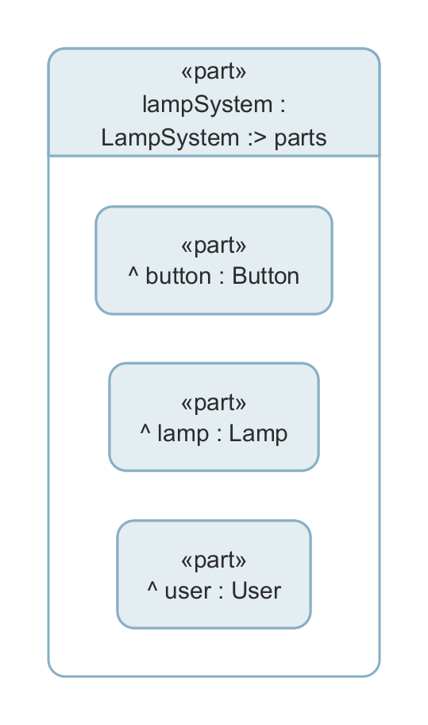
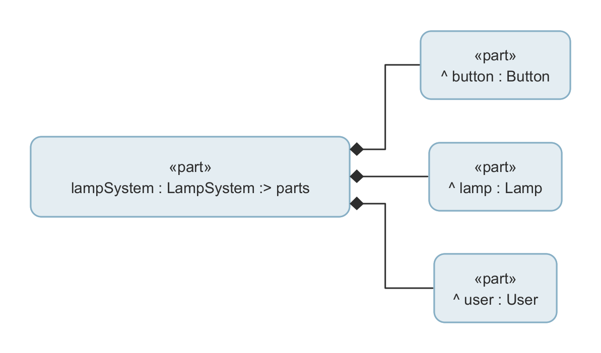
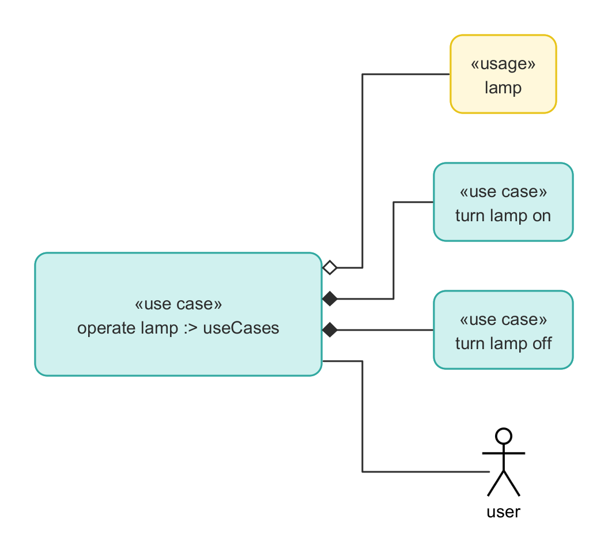
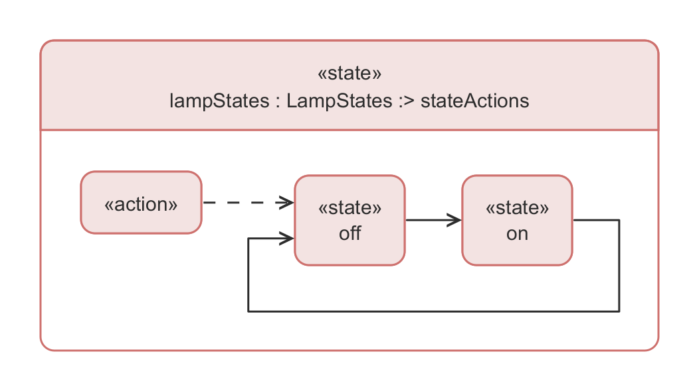
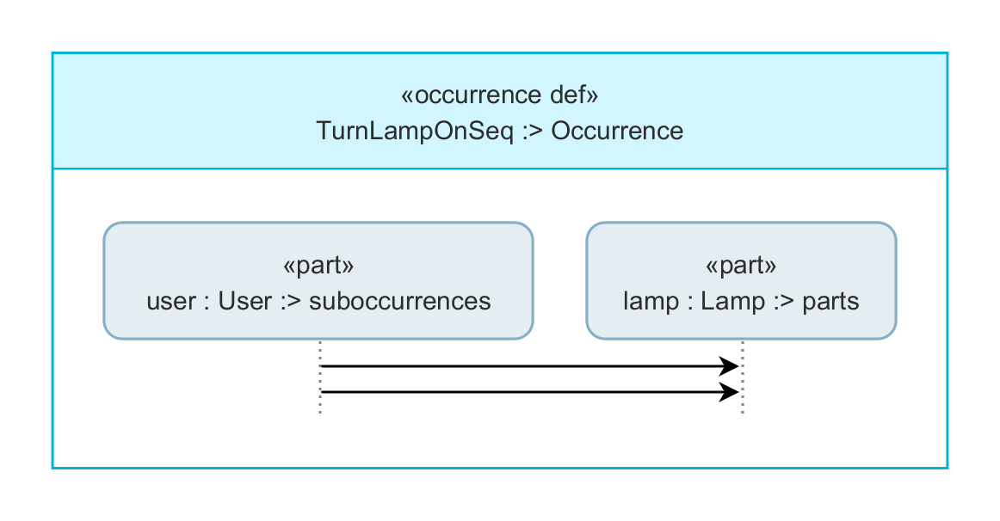
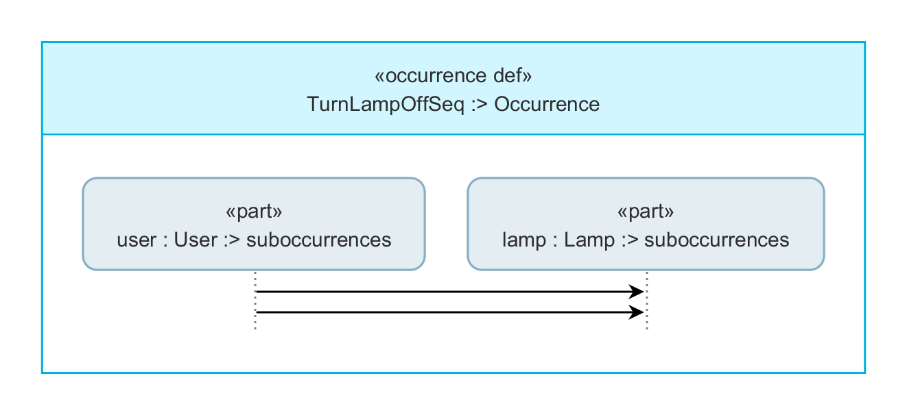

# Minimal SysML v2 Diagram-Generation Baseline

## Tested Tooling

This baseline was recorded with:

- SysIDE Modeler CLI `syside` v0.8.7

When using newer SysIDE versions, rerun the checks and view exports to see whether model validation, formatting, and visualization output have improved.

This repository is a small academic example for exploring the current diagram-generation capabilities of SysIDE.

It is the second iteration of the lamp example used in the related blog post.
The first iteration was used to make a point about the current limitations and our initial misunderstanding of how to drive the renderer.
After clarification in the Sensmetry forum, this version was reduced to a cleaner baseline that now produces results much closer to the blog-post target.

The repository focuses on one question:
how far can current SysIDE diagram output be shaped through view construction?

## Scope

The example probes four targets:

- structure / context
- use case
- sequence-style interaction
- state behavior

The model is intentionally small.
The main experimental levers are in the views, not in domain complexity.

## Quick Start

```powershell
task help
task format
task check
task views
```

The practical inner loop is:

```powershell
task format
task check
task views
```

That sequence keeps formatting deterministic before validation and rendering.

## What This Example Shows

`model/model.sysml` contains one minimal lamp example with focused modeling slices for structure, use case, state, and two interaction variants:

- `LampSystem` as the structural context
- `'operate lamp'` as the top-level use case
- `TurnLampOnSeq` as the turn-on interaction example
- `TurnLampOffSeq` as the turn-off interaction example
- `lampStates` as the state-behavior example

`model/view.sysml` contains the concrete exported views used to probe current rendering behavior.

The structure baseline is represented twice for the same exposed content:

- nested context view
- tree context view

## How The Forum Guidance Is Applied In This Example

- Context views: expose the same structural usage and vary rendering to compare nested versus tree output.
- Use-case view: expose the root and direct children, use tree rendering, and limit depth to keep the result deterministic.
- Sequence-style views: expose occurrence-based interactions directly and keep depth open so message structure is preserved.
- State view: expose the state usage and its direct children to reduce generic library noise while keeping transitions visible.

## Knobs to Play With

The main knobs in this repository are:

- `expose`
- `filter`
- `render`
- `depth`
- `fileName`
- `fileType`
- `zoomLevel`

Practical guidance for this baseline:

- use `expose` to control what the renderer can see
- use `filter` to narrow visible content
- use `render` to compare tree versus nested output
- use `depth` carefully, especially for sequence-style views
- set file-related attributes explicitly so exports are reproducible

For the formal definition of these knobs, see the official SysIDE views documentation in [References](#references).

## Current Limitations

This repository documents the limitations discussed in the blog post and observed in current SysIDE output:

- styling freedom is limited by the current rendering stack
- there is no separate polished sequence or state-diagram mode; those outputs are inferred from model shape
- filtering does not hide compartments; for example, filtering documentation removes the node but not the documentation compartment
- static CLI sequence arrows currently render left-to-right regardless of modeled `from` / `to` direction
- sequence-style views are sensitive to `depth`; shallow traversal can collapse message structure
- lifeline order is not currently deterministic or user-controlled
- the state entry marker and some transition details are still imperfect

## Baseline Output Snapshots

Use the fingerprint tasks to compare or refresh the committed PNG snapshots:

```powershell
task format
task check
task views
task verify-static
task fingerprint
```

`task views` renders the full current baseline.
The individual `task view-*` tasks render one view at a time.
`task verify-static` compares generated PNGs against `static/views` and fails on content mismatches.
`task fingerprint` refreshes the SHA-256 manifests for `output/views` and `static/views`.
The fingerprint and verification implementation is currently Windows-specific.

<details>
<summary><code>lampContextNestedView</code> -> <code>lamp-system-context-nested.png</code></summary>



</details>

<details>
<summary><code>lampContextTreeView</code> -> <code>lamp-system-context-tree.png</code></summary>



</details>

<details>
<summary><code>operateLampUseCaseView</code> -> <code>lamp-use-case.png</code></summary>



</details>

<details>
<summary><code>lampStatesView</code> -> <code>lamp-state-transition.png</code></summary>



</details>

<details>
<summary><code>turnLampOnSequenceView</code> -> <code>lamp-turn-on-sequence.png</code></summary>



</details>

<details>
<summary><code>turnLampOffSequenceView</code> -> <code>lamp-turn-off-sequence.png</code></summary>



</details>

## Baseline Output Fingerprints

<!-- baseline-fingerprints:start -->
| View | File | SHA-256 |
| --- | --- | --- |
| `lampContextNestedView` | `static/views/lamp-system-context-nested.png` | `4659ec06bf3a42605d889e550d0b9ebc140604e56dc42165ef9c500566a6abb5` |
| `lampContextTreeView` | `static/views/lamp-system-context-tree.png` | `6a416be5d06882b21a896b963aca38fde589a8d618d4fbeb3c0d7653aaba70cd` |
| `operateLampUseCaseView` | `static/views/lamp-use-case.png` | `88444fa23fcb82e97f36ab6cd2bd1fb4512538ba3c5a0a04569e958b43313fa0` |
| `lampStatesView` | `static/views/lamp-state-transition.png` | `24c094f949a7b2a933d924cd7be49dae758c42f9f2690f1971949e28286c3636` |
| `turnLampOnSequenceView` | `static/views/lamp-turn-on-sequence.png` | `2575259408eb86387602b9acb64fa1206e660f51e48acbf79cf3e029736ac043` |
| `turnLampOffSequenceView` | `static/views/lamp-turn-off-sequence.png` | `f41399d39f30973730b0503c062ededc3d74c200b775038a7178bdb92cf7afb3` |
<!-- baseline-fingerprints:end -->

## References

### Blog / discussion context

- Related blog post: add link here
- Sensmetry forum thread: Offline diagram generation

### Official documentation

- SysML v2 Views - Configurable attributes  
  <https://docs.sensmetry.com/modeler/sysml-views.html#configurable-attributes>

- SysML v2 Views - Understanding filters  
  <https://docs.sensmetry.com/modeler/sysml-views.html#understanding-filters>

### Standards

- OMG KerML 1.0 - PDF  
  <https://www.omg.org/spec/KerML/1.0/PDF>

- OMG SysML 2.0 Language - PDF  
  <https://www.omg.org/spec/SysML/2.0/Language/PDF>
